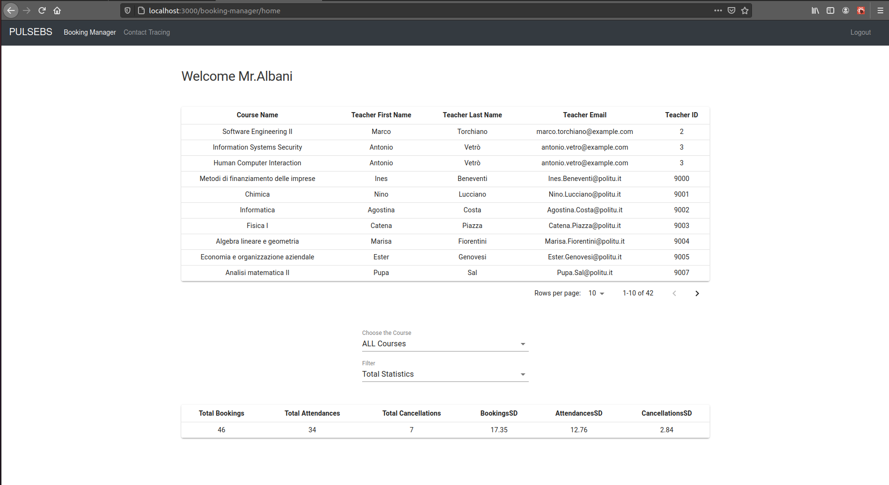

# PULSeBS

Pandemic University Lecture Seat Booking System. 
The web-based application formed on the Scrum process comprises six people in the group. It implements managing to book a seat for university lectures, including multiple authorized users. The chief achievement concerning this project is to represent the real-world scrum working environment equipped with new technologies.  
Technologies used: React-JS, PHP, Agile, Jira, Git, SonarCloud, Cypress, Bootstrap, Material-UI, SQLite, Docker

## Run

    $ docker-compose up

## Login data

You can find preloaded account [here](./server/README.md).

## Mail server

You can check the emails to localhost:8025 logging in with "francexi" and password "testpass"

## Screenshot

These are some snapshots of this WebApp; for utilizing the App entirely, you can do "docker-compose up".

#### Login Page

On the first page, log in to the system via preloaded account [here](./server/README.md).

#### Booking Manager Pages
As a booking manager I want to generate a contact tracing report starting with a positive student so that we comply with safety regulations. 
The medical officials communicate the name of the student to the university, the manager is tasked with entering the info on the positive student and get a full list (a PDF and a CSV) with all the contacts (based on co-presence in the lectures)

#### Booking Manager Pages
As a booking manager I want to monitor usage (booking, cancellations, attendance) of the system.

#### Student Page
As a student I want to access a calendar with all my bookings for the upcoming weeks.

#### Support Officer Pages
As a support officer I want to modify the schedule of courses so that data is up-to-date.

As a support officer I want to upload the list of students, courses, teachers, lectures, and classes to setup the system.

